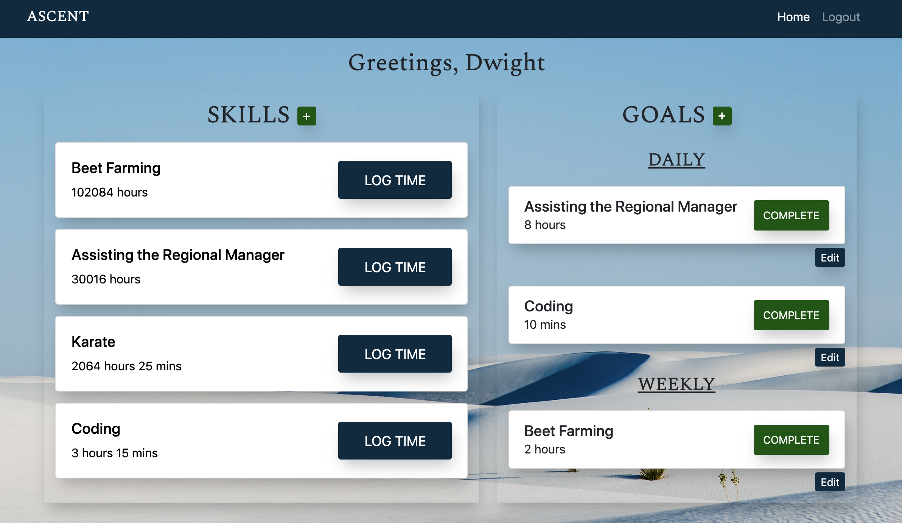

# Ascent
*An application to track your skills. Add daily/weekly goals. See your progress over time.*

**Live Site - https://ascent-app.herokuapp.com/**

**Back-End Repo - https://github.com/jaykmark/ascent-back-end**

  

  

  
## Technology Stack
### **React, Node.js, Express, Mongoose**

Other Tech: HTML/CSS, BootStrap, Chart.js

## Description
Hone your skills. Track your progress. This app is geared towards those that strive for personal development and want to log their progress. A user can add skills they would like to explore or skills they are already good at. Add a daily or weekly goal for that that skill and track your progress over the past week.

## Installation & Set Up
Clone down this repository:

`$ git clone https://github.com/jaykmark/ascent-front-end.git`

You will need `node` and `npm` installed globally on your machine.  

Installation:

`$ npm install`  

To Run Test Suite:  

`$ npm test`  

To Start Server:

`$ npm start`  

To Visit App:

`localhost:3000`

## Future Developments
- Incorporate React Moment
- Add a timer
